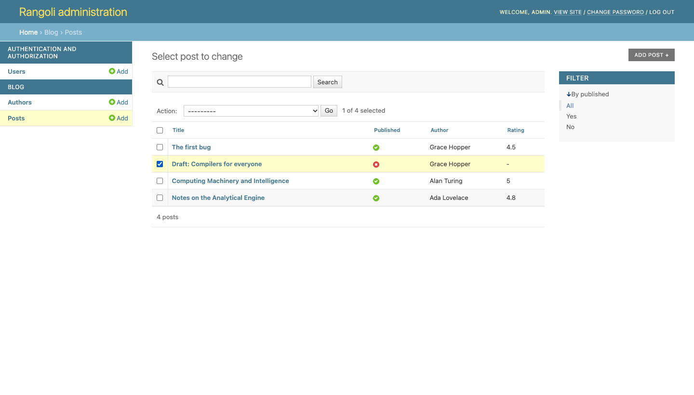

# Rangoli

**A batteries-included, Django-style web framework for Rust.** Typed models, automatic migrations, a generated admin, and auth in a single binary, with fixes for the design gaps Django has carried for years.

> Django is named after a jazz guitarist. Rangoli is named after the Indian art of building one pattern from many small colorful pieces, which is what a batteries-included framework does.



**Status: early (0.1).** The core works end to end and is tested on Postgres, MySQL and SQLite. Read [What's not done yet](#whats-not-done-yet) before building anything real on it.

## Quickstart

```toml
[dependencies]
rangoli = { git = "https://github.com/Harshil-Jani/rangoli-rs" }
tokio = { version = "1", features = ["full"] }
```

```rust
use rangoli::prelude::*;

#[derive(Model, Clone, Debug)]
#[model(table = "blog_author", display = "name")]
pub struct Author {
    pub id: Option<i64>,
    #[field(max_length = 100)]
    pub name: String,
    #[field(max_length = 254, unique)]
    pub email: String,
}

#[derive(Model, Clone, Debug)]
#[model(table = "blog_post", display = "title")]
pub struct Post {
    pub id: Option<i64>,
    #[field(max_length = 200)]
    pub title: String,
    #[field(text)]
    pub body: String,
    pub published: bool,
    #[field(fk = Author)]
    pub author_id: i64,
    pub rating: Option<f64>, // Option = nullable
}

#[tokio::main]
async fn main() -> rangoli::Result<()> {
    App::new().admin::<Author>().admin::<Post>().run().await
}
```

Your binary is also your `manage.py`:

```sh
cargo run -- makemigrations          # writes migrations/<timestamp>_create_blog_author.json
cargo run -- migrate
cargo run -- createsuperuser admin
RANGOLI_DEBUG=1 cargo run            # runserver; admin at http://127.0.0.1:8000/admin/
```

A full example lives in [`examples/blog`](examples/blog/src/main.rs).

## Queries are checked by the compiler

```rust
let posts = Post::objects()
    .filter(Post::PUBLISHED.eq(true) & (Post::TITLE.contains("rust") | Post::RATING.gte(4.5)))
    .exclude(Post::AUTHOR_ID.eq(7))
    .order_by(Post::ID.desc())
    .limit(20)
    .all()
    .await?;

let n = Post::objects().filter(Post::RATING.is_null()).count().await?;
Post::objects().filter(Post::PUBLISHED.eq(false)).update([Post::PUBLISHED.set(true)]).await?;

let mut post = Post::get(id).await?;      // Error::NotFound becomes a 404 in handlers
post.title = "New title".into();
post.save().await?;

let authors = Author::in_bulk(posts.iter().map(|p| p.author_id)).await?; // one query, no N+1
```

`Post::TITLE` is a `Col<Post, String>`. A typo, a string compared to an integer column, or a column from another model in the filter **does not compile**. In Django, `filter(titel__icontains=...)` only fails at runtime.

## Django gaps this closes

| Django pain | Rangoli |
|---|---|
| Lookups are strings (`title__icontains`); typos fail at runtime | Typed column constants; mistakes are compile errors |
| Two branches that each add a migration conflict and need a "merge migration", even for unrelated tables | Migrations are timestamped files and the database records the *set* applied. Unrelated migrations from different branches both apply. A real conflict (two branches changing the same column) is caught and names both files |
| Lazy relation access hides N+1 queries | No lazy loading: a foreign key is an id. `in_bulk` fetches related rows in one query, and the admin batches FK labels the same way |
| ORM is sync-first; async needs `sync_to_async` | Async everywhere, built on tokio and sqlx |
| `SECRET_KEY` must be kept secret and rotated, and leaks are common | There is no `SECRET_KEY`: sessions are random keys stored in the database, and CSRF protection needs no token |
| CSRF tokens in every form, plus `csrf_exempt` footguns | Every unsafe request is checked with the browser's `Sec-Fetch-Site`/`Origin` headers. No tokens, and no way to forget them |
| CSP arrived in Django 6.0 as opt-in middleware | A strict CSP, `nosniff`, `X-Frame-Options` and `Referrer-Policy` are on by default (handlers can override them) |
| No built-in login throttling | After 5 failed logins a username is locked for 15 minutes. Unknown usernames take the same time to reject, so you can't tell which usernames exist |
| `startproject` ships with `DEBUG = True` | Debug is off unless `RANGOLI_DEBUG=1` |
| `get_object_or_404` boilerplate | `Error::NotFound` renders as 404 |
| Settings are an importable, mutable Python module | Typed `Settings` read from the environment (`RANGOLI_DATABASE_URL`, `RANGOLI_DEBUG`, `RANGOLI_BIND`, `RANGOLI_MIGRATIONS`) |
| Deploying means WSGI/ASGI, gunicorn, `collectstatic` and WhiteNoise | One binary. Admin templates, CSS and htmx are compiled in |
| Admin JS is jQuery-era | Server-rendered with htmx: live search, boosted navigation, and it still works without JavaScript |

## The admin

Modeled on Django's admin, page for page: the blue header, breadcrumbs, the app-grouped index with Recent actions, the nav sidebar, and the same wording. Registering a model with `.admin::<M>()` gives you:

- **Changelist**: "Select post to change", sortable columns, search with result counts (live as you type), boolean filters, pagination, an **Action** menu with "0 of N selected", and Django's confirmation page before a bulk delete
- **Change form**: labels on the left, `Please correct the error below.`, foreign keys as selects, unique and foreign-key violations reported on the form, and the Save / Save and add another / Save and continue editing / Delete row
- **Delete confirmation** that lists the protected related objects blocking the delete, or the related rows that cascade with it
- **History** for every object and **Recent actions** on the index, recorded in an admin log (Django's `LogEntry`), with change messages like "Changed title and body."
- Success messages like 'The post "X" was added successfully.'
- user management (password hashes are never shown; leave the field blank to keep the current password), **change password**, login and logout for staff only
- square edges throughout, light and dark themes, and a mobile layout

## Databases

Postgres, MySQL and SQLite share one code path through sqlx's `Any` driver. Only the SQL spelling differs per dialect. CI runs the same end-to-end test on all three.

Field types for now: `i64`, `f64`, `bool`, `String` (`VARCHAR`, or `TEXT` with `#[field(text)]`), each optionally wrapped in `Option` for a nullable column. Field attributes: `max_length`, `text`, `unique`, `password`, `fk = Model`, and `cascade` (`ON DELETE CASCADE`; foreign keys protect referenced rows by default).

## Migrations

```json
{
  "operations": [
    { "op": "add_column", "table": "blog_post", "column": { "name": "views", "type": "int" }, "default": 0 }
  ]
}
```

Operations: `create_table`, `drop_table`, `add_column`, `drop_column`, `alter_column`, and `sql` (the equivalent of Django's RunSQL). Each migration runs in its own transaction. MySQL commits DDL automatically, just as it does under Django. `makemigrations --check` and `migrate --check` exit non-zero, for CI.

## What's not done yet

This is the roadmap, in rough order. Nothing here is implemented yet:

1. **Transactions** (`atomic`) for user code
2. **More field types**: datetime, date, decimal, uuid, json; defaults, indexes, choices
3. **Relations**: many-to-many, reverse accessors, `select_related`-style joins
4. **Admin customization**: `list_display`, `search_fields`, read-only fields, inlines, custom actions, per-model permissions, groups
5. **Forms and templates for your own views** (typed forms, minijinja integration, Django 6.0-style template partials)
6. **REST API layer** (what DRF does)
7. **Background tasks with a real worker** (Django 6.0 ships the task interface but no worker)
8. **WebSockets** (what Channels does)
9. Password reset, groups, email, caching, i18n, embedding migrations in the binary, multi-database routing
10. **WebAssembly**, explored later: the same validation rules running in the browser and on the server, and sandboxed WASM plugins

Known limits today: login lockouts are per process, the admin's foreign-key select loads at most 1000 rows, and changing `unique`/`fk` on an existing column needs an `sql` operation on Postgres and MySQL.

## Development

```sh
cargo test                                                     # unit tests + end-to-end on SQLite
RANGOLI_TEST_DATABASE_URL=postgres://... cargo test --test e2e
RANGOLI_TEST_DATABASE_URL=mysql://...    cargo test --test e2e
```

## License

Dual-licensed under [MIT](LICENSE-MIT) or [Apache-2.0](LICENSE-APACHE), at your option.
